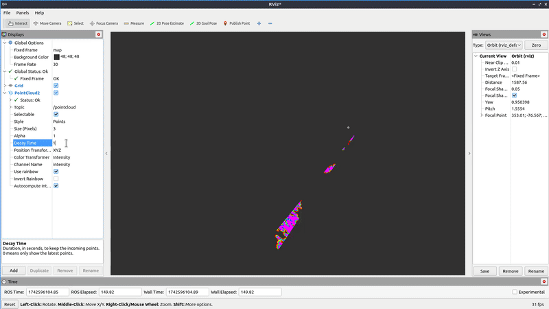

# Convert marine radar data to grid_maps and track targets



## Installation

### Install Dependencies

Run `rosdep update` to install dependencies included in rosdistro.

Clone `project11_msgs` (not included in rosdistro): 

```git clone https://github.com/CCOMJHC/project11_msgs```

### Build

In the root of your workspace, run `colcon build`.


## Nodes

### marine_radar_to_pointcloud Node

Run node with `ros2 run` or `ros2 launch`: 

```ros2 run marine_radar_tracker marine_radar_to_pointcloud``` or 

```ros2 launch marine_radar_tracker marine_radar_to_pointcloud.launch.xml```

#### Publishers:

| Published Topics | Data Type                     |
|------------------|-------------------------------|
| `pointcloud`     | `sensor_msgs/msg/PointCloud2` |

#### Subscriptions:

| Subscribed Topics | Data Type                            |
|-------------------|--------------------------------------|
| `radar_data`      | `marine_sensor_msgs/msg/RadarSector` |

#### Parameters:

| Parameter             | Data Type                  | Default Value |
|-----------------------|----------------------------|---------------|
| `detection_threshold` | `double`                   | `0.0`         |

### marine_radar_tracker Node 

Not yet ported